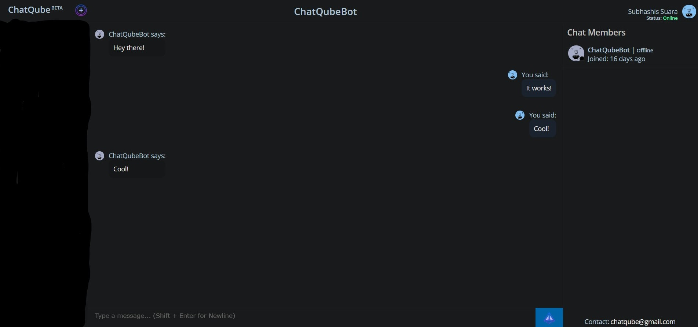

# ChatQube

ChatQube is a chatting web application made using ReactJS, NodeJS, ExpressJS & MongoDB. All registered
users show up in the search list and users can create groups with other members. There is a caching system in place to
optimize the number of requests to the server and to decrease loading times of the clients.

